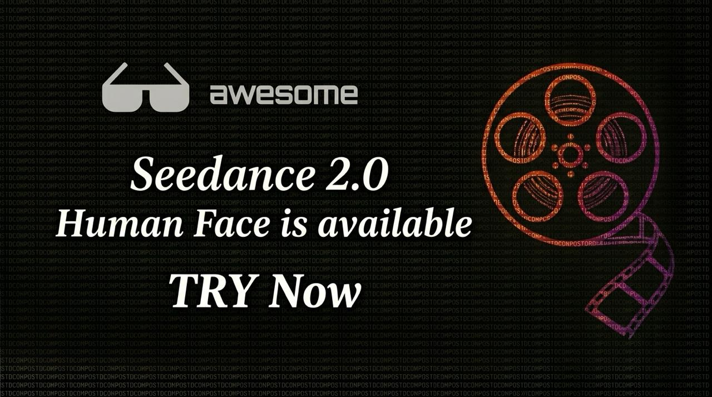

🌐 [English](README.md) | [Español](README.es.md) | [한국어](README.ko.md) | [日本語](README.ja.md) | [Deutsch](README.de.md) | [Français](README.fr.md) | [Türkçe](README.tr.md) | [Русский](README.ru.md) | **Português** | [简体中文](README.zh-CN.md) | [繁體中文](README.zh-TW.md)

---

  

  <strong>Seedance 2.0 Human Face Now Available Try Now</strong>

# 🎬 Seedance 2.0 Gateway Service

> **O Seedance 2.0 Gateway Service já está disponível.** 
>
> 🚀 **[evolink.ai](https://evolink.ai/signup?utm_source=github&utm_medium=readme&utm_campaign=seedance-2-api)** fornece acesso estável ao Seedance 2.0 Gateway Service para construção de aplicações de vídeo AI multimodais.

---

## 🎯 Sobre a API

O Seedance 2.0 Gateway Service permite que você integre geração de vídeo controlável em seus produtos.

  <a href="https://evolink.ai/seedance-2-0?utm_source=github&utm_medium=readme&utm_campaign=seedance-2-api"><strong>👉 Comece hoje mesmo →</strong></a>

> Por favor revise a [Disponibilidade Regional](./docs/regional-availability.pt.md) antes da integração.
